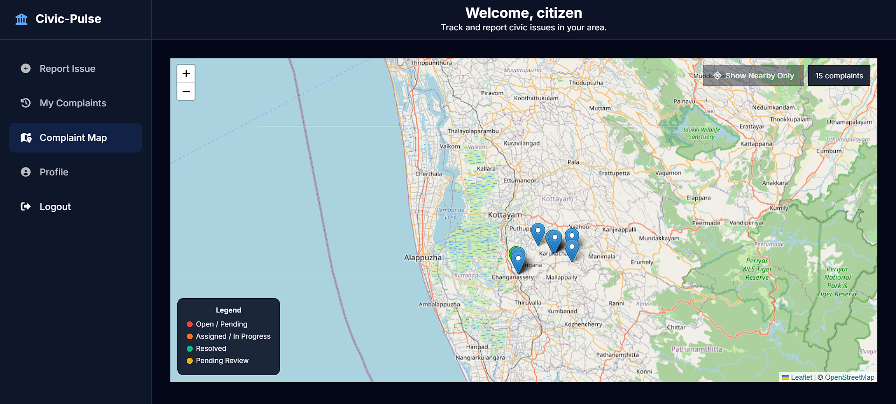
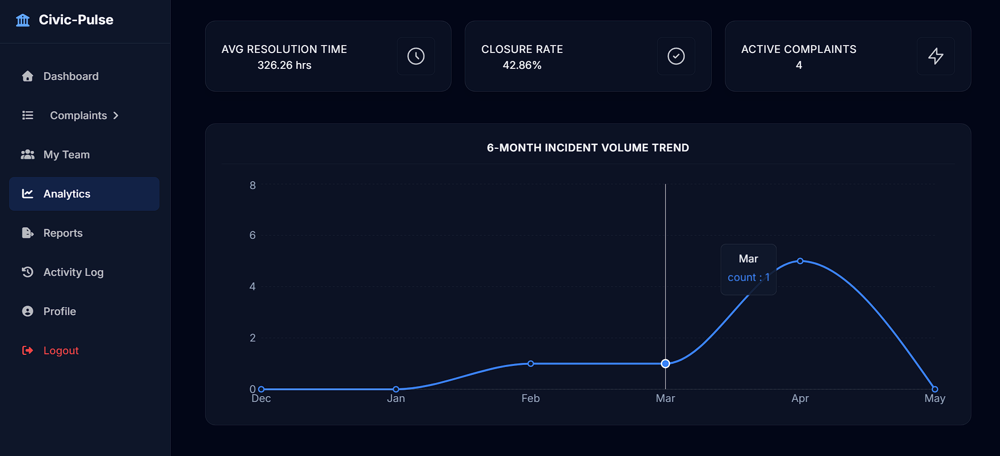
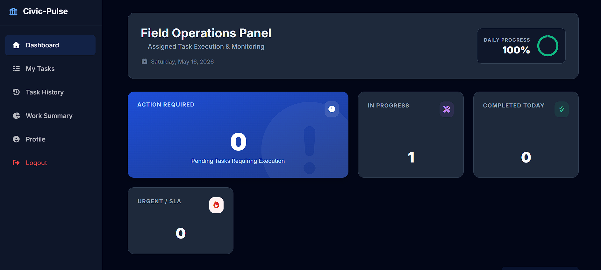
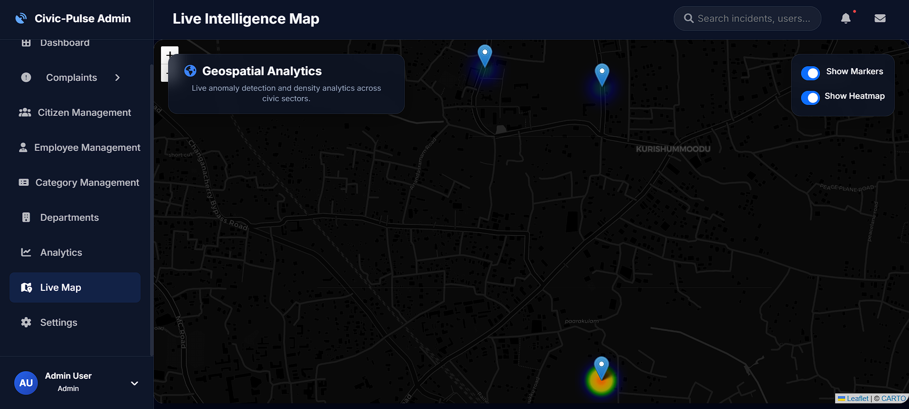

# Civic-Pulse

A modern, comprehensive Civic Complaint Management System — built with the MERN stack for municipalities, civic bodies, and citizens.
Centralizes civic issue reporting, intelligent AI-based image triage, geospatial mapping, field worker dispatch, SLA monitoring, and dynamic analytics — designed to bridge the gap between citizens and authorities.

**Run it locally with Node.js and MongoDB.**


**Key Features** • **Technology Stack** • **User Roles** • **Installation** • **Usage** • **API Overview** • **Troubleshooting** • **Contributing** • **Contributors** • **License**

---

## 📸 Screenshots

### Citizen Complaint Map

*Interactive map with status-coded complaint pins allowing citizens to track neighborhood issues.*

### Officer Performance

*Departmental efficiency metrics showing resolution rates, SLA tracking, and timeline statistics.*

### Field Worker Interface

*Task queues, priority flags, and status updates.*

### Admin Heatmaps

*City-wide visualization of high-frequency complaint zones*

---

## ✨ Key Features

- **Role-Based Access Control (RBAC)** — Four dedicated roles: Admin, Officer, Field Worker, Citizen — each with tailored UI and strict API protection.
- **AI-Powered Vision Triage** — Automatic image analysis using Google Cloud Vision to detect issue severity and category (with fail-open graceful degradation).
- **Geospatial Mapping** — Leaflet-integrated maps for precise coordinate-based issue reporting and cluster visualization.
- **Smart Workflows & SLA** — Automated routing to specific departments, SLA overdue flags, and multi-stage status tracking (`REPORTED` → `ASSIGNED` → `IN_PROGRESS` → `RESOLVED`).
- **Comprehensive Dashboards** — Role-specific statistics, recent activity logs, and performance metrics.
- **Reporting & Export** — CSV/PDF report generation for department heads and administrators.
- **Secure Authentication** — JWT-based sessions, bcrypt password hashing, and endpoint-level middleware guards.

---

## 💻 Technology Stack

- **Backend** — Node.js, Express.js (REST API)
- **Database** — MongoDB (Mongoose ODM)
- **Frontend** — React.js, Vanilla CSS variables, Context API
- **Libraries & APIs** 
  - *Google Cloud Vision API* — AI image classification
  - *Leaflet / React-Leaflet* — Interactive maps
  - *JSON Web Tokens (JWT)* — Secure auth
  - *Bcrypt.js* — Password encryption
- **Environment** — Windows / Linux / macOS

---

## 👥 User Roles & Functionalities

### 👑 Admin
- Full system control: Manage users, departments, categories, and view global analytics.
- View city-wide heatmaps and public dashboard stats.
- Export global reports.

### 🎖️ Officer
- Manage department-specific complaints and assign them to Field Workers.
- Monitor SLA breaches, team performance, and resolution times.
- Review resolved complaints and verify evidence.

### 🔧 Field Worker
- Receive assigned tasks with location coordinates and priority tags.
- Update task statuses in real-time (`IN_PROGRESS`, `RESOLVED`).
- Upload completion evidence (images).

### 🏠 Citizen
- Report civic issues with images and precise map locations.
- Track real-time status of submitted complaints.
- View nearby issues on the interactive community map.

---

## 🛠️ Installation and Configuration

### Prerequisites
- [Node.js](https://nodejs.org/) (v18+ recommended)
- [MongoDB](https://www.mongodb.com/) (Local instance or Atlas URI)
- Git

### 1. Clone the repository
```bash
git clone https://github.com/kevincyriac-2005/Civic-Pulse.git
cd Civic-Pulse
```

### 2. Backend Setup
```bash
cd backend
npm install
```
Copy `.env-example` to `.env` and configure your database and secrets:
```env
PORT=5000
MONGO_URI=mongodb://127.0.0.1:27017/civic_db
JWT_SECRET=your_super_secret_key
GOOGLE_APPLICATION_CREDENTIALS=/absolute/path/to/civicpulse-secrets/vision-key.json
EMAIL_USER=your_email@gmail.com
EMAIL_PASS=your_gmail_app_password
```

**Vision API Key Setup:**
Create a folder named `civicpulse-secrets` in the root of your project. Copy the template from `civicpulse-secrets-example/vision-key-example.json` into your new folder, rename it to `vision-key.json`, and fill in your actual Google Cloud credentials.

### 3. Frontend Setup
```bash
cd ../frontend
npm install
```

### 4. Launch Application
Start the backend (from `backend` folder):
```bash
npm run dev
```
Start the frontend (from `frontend` folder):
```bash
npm start
```
Open your browser to `http://localhost:3000`.

---

## 🔌 API Documentation

The backend exposes a RESTful API at `http://localhost:5000/api/`. All protected endpoints require a `Bearer` token in the `Authorization` header.

### Core Endpoints Overview

| Category | Endpoint | Method | Description | Role Required |
|----------|----------|--------|-------------|---------------|
| **Auth** | `/auth/login` | POST | User login and token generation | Public |
| **Auth** | `/auth/register` | POST | Register a new citizen | Public |
| **Citizen**| `/citizens/me` | GET | Fetch citizen profile | Citizen |
| **Complaint**| `/complaints` | POST | Create a new complaint | Citizen |
| **Complaint**| `/complaints/map` | GET | Fetch all map coordinates | Citizen |
| **Officer** | `/officers/dashboard-summary` | GET | Department KPIs | Officer |
| **Officer** | `/complaints/assign` | PUT | Assign task to FW | Officer |
| **Field** | `/field-workers/tasks` | GET | Fetch assigned queue | Field Worker |
| **Field** | `/field-workers/update-status/:id` | PUT | Update complaint status | Field Worker |
| **Admin** | `/admin/public-stats` | GET | Fetch global system stats | Public |
| **Admin** | `/admin/heatmap` | GET | Fetch heatmap coordinates | Admin |

> *Note: A comprehensive test suite is available. Run `node test-suite.js` in the backend folder to validate all endpoints.*

---

## ⚠️ Troubleshooting

**Vision API Errors (`PERMISSION_DENIED`)**
- *Cause:* Google Cloud project lacks an active billing account.
- *Fix:* The app is designed to **fail-open**. It will catch the error, log a warning, default the complaint to a "General" category, and proceed successfully. To fix permanently, attach a billing account in GCP.

**Authentication Fails / "No Token Provided"**
- *Cause:* Attempting to access protected routes (`/api/complaints`, `/api/admin/*`) directly in a browser or without a valid JWT.
- *Fix:* Ensure you are logging in via the frontend or attaching the `Authorization: Bearer <token>` header in tools like Postman.

**MongoDB Connection Refused**
- *Cause:* Local MongoDB service is not running.
- *Fix:* Start MongoDB daemon (`mongod`) or ensure your Atlas URI in `.env` is correct.

---

## 🤝 Contributing

Contributions are welcome!

1. Fork the repo
2. Create your feature branch (`git checkout -b feature/amazing-feature`)
3. Commit your changes (`git commit -m 'Add amazing feature'`)
4. Push to the branch (`git push origin feature/amazing-feature`)
5. Open a Pull Request

---

## 🙏 Acknowledgements

- **Google Cloud Platform** for Vision API integration.
- **Leaflet & OpenStreetMap** for open-source mapping.

---

## 👥 Contributors

Big thanks to the core team:

- **Kevin Cyriac** — Core Developer

---

## 📄 License

Distributed under the MIT License.
See `LICENSE` for full details.
Free to use, modify, and distribute.
